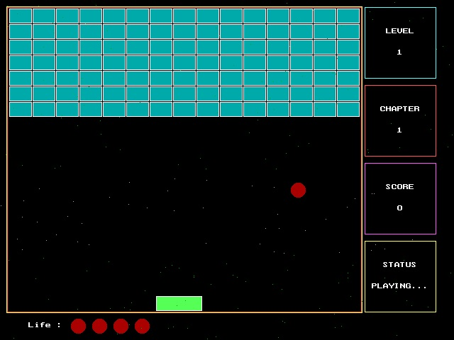

# **Breakout Game**

**Objective of BreakoutGame:**

- A layer of bricks cover the the top section of the screen, with the goal of destroying them all.
- A ball moves straight around the screen, bouncing off the top and two sides of the screen.
- Player has a horizontally movable paddle to bounce the ball upward, keeping it in play.
- When a brick is hit, the ball bounces back and the brick is destroyed.
- The player loses a turn when the ball touches the bottom of the screen.

**Requirements to Run:**

All you will need in order to run this game is Cinder. You should have this project within the Cinder directory to get it to run, as well as set the working directory to this project path.

**Instructions to Play:**

This game starts off on the main menu, with 3 difficulty levels - easy, medium, and hard. The game will start with the ball located right above the platform. In order to start, you must move the platform, and then the ball will begin moving based on the difficulty's starting speed. There is the option to either move the platform with the left and right keys. or by dragging the mouse. Once all the bricks are destroyed, you will go to the next level, with the ball slightly increasing each level. You are given 3 extra lives, once the ball reached the bottom and all of those lives are gone, the game will be over and you will be directed back to the main menu, where you can click a button to view the high scores. 